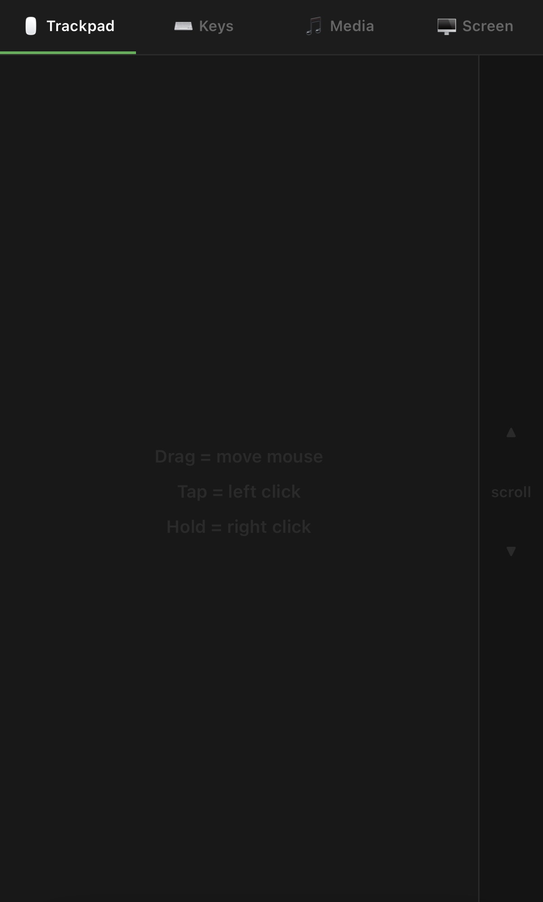
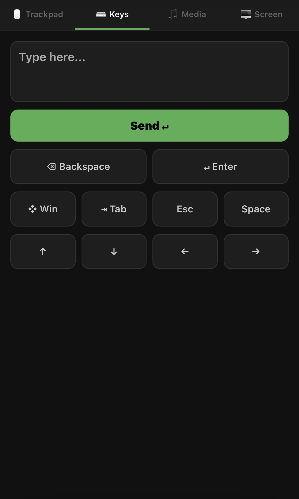

# Remote Mouse Controller

A lightweight remote mouse and media controller built with Python and Flask.

Control your Windows computer from any phone connected to the same Wi-Fi network through a responsive web interface.

## Features

- Wireless mouse movement
- Left and right click
- Scroll support
- Remote keyboard input
- Media playback controls
- System volume controls
- Live screen mirroring
- Mobile optimized interface

## Technologies

- Python
- Flask
- PyAutoGUI
- Pillow
- Pynput
- HTML
- CSS
- JavaScript

## Installation

```bash
pip install -r requirements.txt
```

## Run

```bash
python remote_mouse.py
```

Open the displayed IP address on any device connected to the same network.

## Future Improvements
-Game mode for cloud gaming
- HTTPS support
- Authentication
- File transfer
- Multi-monitor support
- Clipboard sync
  
  
## License

MIT
